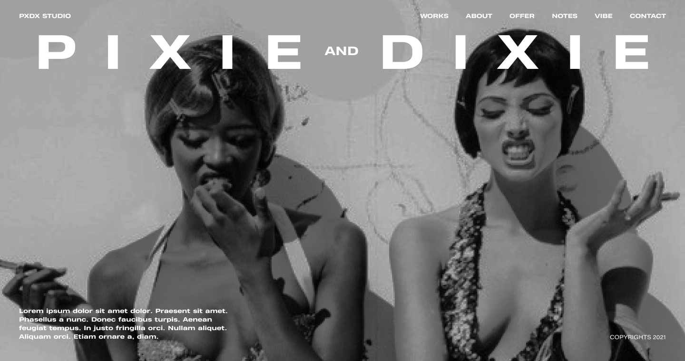

# PXDX STUDIO

Creative Agency, UX/UI Designers Portfolio Website



[comment]: <> ([Article on Codrops]&#40;https://tympanus.net/codrops/?p=52018&#41;)

[comment]: <> ([Demo]&#40;https://tympanus.net/Development/ImageStackGrid/&#41;)


## Installation

Install dependencies:

```
npm install
```

Compile the code for development and start a local server:

```
npm start
```

Create the build:

```
npm run build
```

[comment]: <> (## Credits)

[comment]: <> (- Images by [Unsplash]&#40;http://unsplash.com&#41;)


[comment]: <> (## Misc)

[comment]: <> (Follow Codrops: [Twitter]&#40;http://www.twitter.com/codrops&#41;, [Facebook]&#40;http://www.facebook.com/codrops&#41;, [GitHub]&#40;https://github.com/codrops&#41;, [Instagram]&#40;https://www.instagram.com/codropsss/&#41;)

## License
[MIT](LICENSE)

Made with :blue_heart: by [donotdevelopmyapp](https://www.donotdevelopmy.app)


